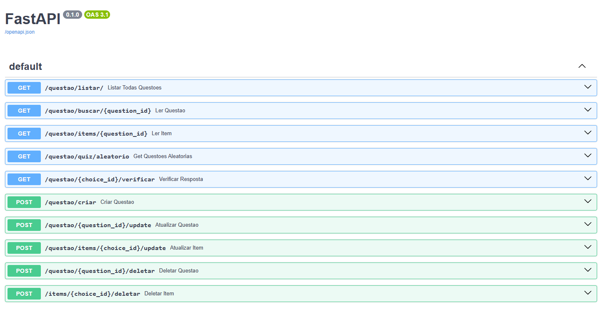

# 🧠 FastAPI Async Quiz System

Este projeto é um backend de sistema de perguntas e respostas desenvolvido em Python com FastAPI. Ele demonstra as melhores práticas de desenvolvimento assíncrono e acesso eficiente a dados.

O sistema permite a gestão completa (CRUD) de questões e a interação do usuário através de rotas para quizzes aleatórios.

## ⚙️ Tecnologias Utilizadas

* **Framework:** FastAPI (Assíncrono)
* **Banco de Dados:** PostgreSQL (Configuração obrigatória)
* **Driver Assíncrono:** `asyncpg`
* **ORM:** SQLAlchemy 2.0 (Async API)
* **Validação:** Pydantic
* **Configuração:** `python-dotenv`

## 🚀 Principais Recursos da API

* **CRUD Completo (via POST):** Gerenciamento total de questões e opções de resposta (criar, buscar, atualizar, deletar).
* **Performance Assíncrona:** Utilização do `create_async_engine` e `AsyncSession` do SQLAlchemy para garantir que as operações de DB não bloqueiem o *event loop* do servidor.
* **Otimização de DB (Eager Loading):** Uso de `selectinload` para buscar questões e suas opções relacionadas em uma única operação (evitando o problema N+1 Selects).
* **Interação com o Quiz:** Rota para buscar questões aleatórias e rota para verificar a correção de uma resposta.

## 💡 Primeiros Passos

### Pré-requisitos

1.  Python 3.8+ instalado.
2.  Um servidor **PostgreSQL** rodando localmente (com as credenciais de `DB_USER` e `DB_PASSWORD` prontas).

### 1. Clonar o Repositório

```bash
git clone [https://github.com/SEU_USUARIO/fastapi-quiz-system.git](https://github.com/SEU_USUARIO/fastapi-quiz-system.git)
cd fastapi-quiz-system
```
### 2. Instalar Depedencias

pip install -r requirements.txt

### 3. crie seu arquivo.env: 

cp .env.example .env
```bash
DB_USER="NOME-USER-POSTGRE"
DB_PASSWORD="SENHA-POSTGRE"
DB_HOST="localhost"
DB_PORT="5432"
DB_NAME="NOME-DO-BD-POSTGRE"
DATABASE_URL="postgresql+asyncpg://${DB_USER}:${DB_PASSWORD}@${DB_HOST}:${DB_PORT}
```
### 4. execute a api :

uvicorn main:app --reload

A API estará disponível em http://127.0.0.1:8000

📚 Documentação Interativa
O FastAPI gera automaticamente uma documentação interativa.


